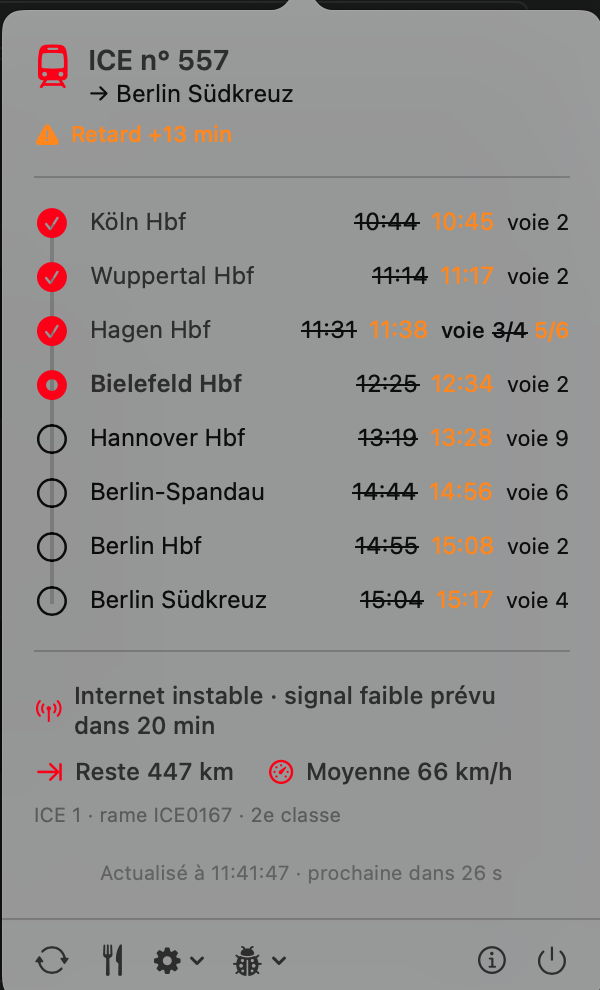

# SNCFWifi — Widget barre de menus macOS 🚄

[](https://github.com/antvgr/sncfwifi-macwidget/actions/workflows/build.yml)
[](https://github.com/antvgr/sncfwifi-macwidget/releases/latest)
[](https://github.com/nuclearrockstone/coding-with-ai-badge)

Un widget pour la barre de menus macOS qui exploite l'API du portail WiFi de votre train pour
afficher en temps réel les informations de votre trajet : gare suivante, vitesse, retard,
données mobiles, etc.

Trois réseaux embarqués sont pris en charge — **WiFi SNCF**, **WiFi Eurostar** (transmanche et
continental) et **WIFIonICE** (Deutsche Bahn) — et détectés automatiquement. Chaque réseau expose des données différentes : le tableau de la section
[Réseaux pris en charge](#réseaux-wifi-pris-en-charge-) dit exactement ce que vous verrez dans
chaque train.

---

## Réseaux WiFi pris en charge 🚆

| Réseau | Trains | API | Desserte · retard · ETA | Voie | Vitesse | Position | Opérateurs | Données | Connectivité | Carte du bar |
|---|---|---|---|---|---|---|---|---|---|---|
| **WiFi SNCF** | TGV INOUI, Intercités, Lyria | `wifi.sncf` | ✅ | ❌ | ✅ | interne¹ | ❌ | ✅ | ✅ (0…5) | ❌⁴ |
| **WiFi Eurostar** | Eurostar transmanche (Londres ↔ Paris / Bruxelles / Amsterdam) et Eurostar continental (ex-Thalys) | `ombord.info` (Icomera) | ❌² | ❌ | ✅ | ✅ | ✅ | ✅ | ✅ (lien montant³) | ❌ |
| **WIFIonICE** | ICE (Deutsche Bahn) | `iceportal.de` | ✅ | ✅ | ✅ | ✅ | ❌ | ❌⁵ | ✅ **+ prévision** | ✅ |

<sub>¹ La position GPS sert à détecter l'arrêt en gare, elle n'est pas affichée. ·
² L'API du portail n'expose aucune donnée de trajet, voir ci-dessous. ·
³ Le RSSI disponible est celui des modems 4G du toit, pas du WiFi de la voiture : il est affiché
comme « lien montant » plutôt que déguisé en qualité WiFi. ·
⁴ L'endpoint `bar/attendance` est lu et présent dans le JSON de debug, mais sa sémantique reste à
confirmer. ·
⁵ Le WiFi des ICE est sans quota : l'API n'expose aucun compteur.</sub>

### 🇫🇷 WiFi SNCF — TGV INOUI, Intercités, Lyria

SSID reconnus : `_SNCF_WIFI_INOUI`, `OUIFI`, `SNCF_WIFI_INTERCITES`, `WIFI_SNCF`, `_WIFI_LYRIA`

<p align="center">
  
</p>

Ce que le widget affiche :

- **Pastille** : prochaine gare et temps restant (`Milano · 3h42`) avec jauge de progression, ou
  `En gare de Lyon` à l'arrêt ; le retard s'intercale 5 s (`⚠ +12min · Régulation du trafic`)
- **Panneau** : numéro de train et destination, desserte complète avec heures théoriques barrées
  en cas de retard, vitesse, qualité WiFi et nombre de passagers connectés, consommation de
  données avec heure de remise à zéro
- **Réglages** : choix de la gare d'arrivée (pour l'ETA et la progression) et notification
  système 5 / 10 / 15 min avant l'arrivée

| Endpoint | Contenu utilisé |
|---|---|
| `GET /router/api/train/gps` | vitesse (**en m/s**), latitude, longitude |
| `GET /router/api/train/progress` (ou `/details`) | numéro de train, arrêts, horaires, retard et cause |
| `GET /router/api/connection/statistics` | qualité WiFi (0…5), appareils connectés |
| `GET /router/api/connection/status` | données consommées / restantes, prochaine remise à zéro |
| `GET /router/api/bar/attendance` | affluence au bar — lue et présente dans le JSON de debug, pas encore affichée |

### 🇪🇺 WiFi Eurostar — transmanche et continental (ex-Thalys)

Toute la flotte Eurostar utilise le portail Icomera « Internet Ombord », que ce soit sur les
liaisons transmanche ou sur les rames continentales héritées de Thalys.

SSID reconnus : `EurostarWiFi`, `Eurostar WiFi`, `Eurostar`, `_EUROSTAR_WIFI`, `THALYSNET`, `_THALYSNET`

<p align="center">
  
  &nbsp;&nbsp;
  
</p>

Ce que le widget affiche :

- **Pastille** : `Eurostar · 278 km/h`, sans jauge — il n'y a pas de progression à calculer
- **Panneau** : numéro de rame, vitesse, position GPS, altitude, cap cardinal, état des liens
  montants (`4G · 5/5 liens · -28 dBm`), **opérateurs mobiles agrégés** (`Orange BE ×2 ·
  Proximus ×2 · BASE`), appareils connectés, consommation de données

**Pas de desserte, ni d'horaires, ni de retard sur ce réseau** : le portail expose bien une API
PIS (`onboard.eurostar.com/services/pis/v1/journey`, `/route`, `/stations`, `/vehicle`), mais elle
répond `{"error":"journey not found"}` là où elle a été testée. C'est une limite de l'API
embarquée, pas du widget — si elle s'avère provisionnée sur d'autres rames, la desserte pourra
être ajoutée sans rien changer d'autre (il suffit de déclarer `.journey` et de remplir `stops`).

> Les relevés d'endpoints ci-dessous ont été faits sur une rame **continentale** (`eurostar-4342-2i`).
> La flotte transmanche partageant le même portail Icomera, les mêmes endpoints s'appliquent ;
> si vous constatez un écart à bord, **Debug → Copier le JSON** donne le détail des réponses.

| Endpoint | Contenu utilisé |
|---|---|
| `GET https://www.ombord.info/api/jsonp/position/` | latitude, longitude, altitude, vitesse (**en m/s**), `cmg` (cap), satellites |
| `GET https://www.ombord.info/api/jsonp/user/` | quota de l'appareil (`data_total_used` / `data_total_limit`, en octets) |
| `GET https://www.ombord.info/api/jsonp/users/` | appareils connectés (`online` / `total`) |
| `GET https://www.ombord.info/api/jsonp/connectivity/` | liens montants : technologie, RSSI, `operator_id` (PLMN → opérateur) |
| `GET https://www.ombord.info/api/jsonp/system/` | `system_name` (ex. `eurostar-4342-2i`) → numéro de rame |

> Ces réponses sont du **JSONP même sans paramètre `callback`** (`({ … });`) : le corps est
> décapsulé avant d'être décodé.

### 🇩🇪 WIFIonICE — ICE (Deutsche Bahn)

SSID reconnu : `WIFIonICE`

<p align="center">
  
  &nbsp;&nbsp;
  
</p>
<p align="center">
  
</p>

C'est l'API la plus riche des trois. Ce que le widget affiche :

- **Pastille** : gare d'arrivée et temps restant (`Berlin · 3h18`) avec jauge de progression,
  calculée sur les **distances réelles** et non estimée à partir des horaires ;
- **Desserte** avec, pour chaque arrêt, l'heure prévue barrée en cas de retard **et la voie** —
  seul réseau à la donner. Un changement de voie s'affiche voie ~~3/4~~ **5/6** et déclenche une
  **notification système** quand il concerne votre gare d'arrivée ;
- **Connectivité avec prévision** : « Internet instable · signal faible prévu dans 20 min ».
  Aucun autre réseau n'annonce la dégradation à venir ;
- **Distance restante**, **vitesse moyenne** depuis le départ et identité de la rame
  (`ICE 1 · rame ICE0167 · 2e classe`) ;
- **Carte du bar-restaurant** dans un panneau dédié, ouvert par l'icône couverts du pied de
  page : catégories, prix en euros et articles épuisés. Elle n'est chargée qu'à l'ouverture de ce
  panneau, jamais à chaque cycle.

Ce que l'API ne donne pas : la **cause** du retard (seulement sa durée), aucun **quota de
données**, et la carte **en allemand uniquement** — vérifié via l'en-tête `Accept-Language`, les
paramètres d'URL et le bundle du portail : le sélecteur de langue traduit les libellés du site,
pas le catalogue.

| Endpoint | Contenu utilisé |
|---|---|
| `GET https://iceportal.de/api1/rs/status` | vitesse (**en km/h**, contrairement aux deux autres réseaux), position, `vzn` (n° de train), `tzn` (rame), `series` (modèle), classe, `connectivity` (état courant **et** prévision) |
| `GET https://iceportal.de/api1/rs/tripInfo/trip` | arrêts, horaires prévus et réels, retards, **voie prévue et réelle**, distances (`actualPosition`, `distanceFromLastStop`, `totalDistance`) |
| `GET https://iceportal.de/bap/api/bap-service-status` | service de commande actif ou non — conditionne l'icône couverts |
| `GET https://iceportal.de/bap/api/products` | carte du bar-restaurant : catégories, prix (EUR/CHF), disponibilité |

> ⚠️ `actualPosition` n'est **pas** la position du train mais la distance du dernier arrêt passé.
> La position réelle vaut `actualPosition + distanceFromLastStop`.

### Comment le réseau est détecté

1. Le **SSID** est comparé aux listes ci-dessus : si ça correspond, l'API du réseau est appelée
   directement.
2. Si le SSID est **inconnu** ou **illisible** (macOS 14.4+ exige l'autorisation Localisation pour
   le lire), les APIs de tous les réseaux sont sondées en parallèle, un appel chacune. Le verdict
   est mémorisé par SSID pour ne pas re-sonder à chaque cycle ; un réseau sans train est écarté
   pendant 5 min, et le bouton **Actualiser** court-circuite ce délai.
3. Un réseau peut exiger que l'hôte de son API résolve vers une **adresse privée** : à bord,
   `ombord.info` pointe sur le routeur du train. Sans ce contrôle, une API joignable depuis
   l'internet public pourrait afficher un train fantôme.

Hors d'un réseau connu, le widget ne fait aucun appel : c'est autant de batterie économisée.

---

## Téléchargement ⬇️

> Pas besoin de compiler — téléchargez directement le `.zip` depuis la page **Releases**.

**[→ Télécharger la dernière version](https://github.com/antvgr/sncfwifi-macwidget/releases/latest)**

1. Décompressez le `.zip`
2. Glissez `SNCFWifi.app` dans votre dossier `Applications`
3. Double-cliquez pour lancer — l'icône apparaît dans la barre des menus

> **macOS bloque l'app** (non signée avec un certificat Apple Developer) lors du premier lancement. Deux options :
> - **Méthode simple** : faites un **clic droit → Ouvrir** sur `SNCFWifi.app`, puis cliquez **Ouvrir** dans la fenêtre d'avertissement
> - **Via le Terminal** : après avoir déplacé l'app dans `/Applications`, exécutez `xattr -cr /Applications/SNCFWifi.app` puis double-cliquez normalement

💡 **Lancement automatique au démarrage** : `Réglages Système > Général > Éléments de connexion` → cliquez `+` et ajoutez `SNCFWifi.app`.

---

## Installation via Homebrew 🍺

```bash
brew tap antvgr/sncfwifi https://github.com/antvgr/sncfwifi-macwidget
brew install --cask sncfwifi
```

Mise à jour vers la dernière version :

```bash
brew reinstall --cask sncfwifi
```

> L'app étant signée en ad-hoc, si macOS la bloque au premier lancement :
> `xattr -dr com.apple.quarantine /Applications/SNCFWifi.app` (ou clic droit → **Ouvrir**).

---

## Prérequis ⚙️

- macOS 11 (Big Sur) ou plus récent — Apple Silicon et Intel (binaire universel)
- Connexion au WiFi d'un train pris en charge (SNCF, Eurostar ou ICE) pour que l'API réponde
- *(pour compiler)* Xcode Command Line Tools (`xcode-select --install`)

---

## Compilation manuelle 🔨

Un script bash compile et empaquète le projet en `.app` :

```bash
chmod +x build.sh
./build.sh
open SNCFWifi.app
```

---

## Ajouter un réseau 🧩

Un réseau = **un fichier**. Rien à modifier dans les vues, le contrôleur ou la pastille.

**1.** Créez `Sources/MonReseauDataSource.swift` conforme à `TrainDataSource` :

```swift
final class MonReseauDataSource: TrainDataSource {

    let descriptor = TrainProviderDescriptor(
        id: "monreseau",
        displayName: "Mon Réseau",
        ssids: ["mon_wifi_train"],        // en minuscules
        accentHex: 0x1B7F4B,              // couleur d'accent du panneau
        features: [.speed, .position],    // pilote la forme du panneau
        apiHost: "portail.exemple",
        requiresPrivateAPIHost: true      // l'API n'est joignable qu'à bord
    )

    func probe(completion: @escaping (Bool) -> Void) {
        // Un seul appel : « suis-je à bord ? »
    }

    func fetch(completion: @escaping (TrainSnapshot?) -> Void) {
        // Appelez votre API, puis rendez un TrainSnapshot (nil si injoignable).
        // Les spécificités du réseau passent par TrainViewState.metrics :
        //   MetricRow(id: "position", symbol: "location.fill", text: "…")
        // Déclarez .journey et remplissez stops + JourneyContext pour obtenir
        // la timeline, l'ETA et les notifications d'arrivée sans code en plus.
        // Renseignez StopRow.platform / .scheduledPlatform et la voie s'affiche
        // dans la timeline, avec notification si elle change.
    }

    // Facultatif : déclarez .onboardMenu et implémentez fetchMenu pour obtenir
    // le panneau restaurant et son icône dans le pied de page. Sans cela, la
    // valeur par défaut du protocole répond « pas de carte ».
    func fetchMenu(completion: @escaping (OnboardMenu?) -> Void) { … }
}
```

**2.** Enregistrez-le dans `TrainProviders.all` (`Sources/TrainProvider.swift`). L'ordre ne sert
qu'à départager si deux réseaux répondent : aucun n'est privilégié.

**3.** Ajoutez le fichier à `SWIFT_SOURCES` dans `build.sh` (la liste est explicite, pas un glob).

**4.** Testez : `./build.sh && open SNCFWifi.app`, et **Debug → Copier le JSON** pour vérifier les
payloads bruts reçus. Sans être à bord, un petit binaire de sonde suffit :
`swiftc Sources/*.swift votre_main.swift -o sonde`.

---

## Mode Démo via serveur local 🧪

Permet de simuler un trajet sans être dans le train, **sur les deux réseaux** : le serveur sert
les endpoints SNCF et les endpoints Icomera en parallèle, et **Debug → Réseau simulé** choisit
lequel l'app interroge.

1. Lancer le serveur :
   ```bash
   chmod +x start_demo_server.sh
   ./start_demo_server.sh
   ```
2. Ouvrir le panneau de configuration :
   - dans l'app : **Debug → Ouvrir le panneau démo**
   - ou directement : `http://127.0.0.1:8787`
3. Activer **Debug → Mode Démo** dans l'app.

Le panneau HTML fait varier vitesse, retard et cause, index d'arrêt, arrêt en gare, qualité WiFi
et données côté SNCF, ainsi que le système, les modems, les opérateurs et le quota côté Eurostar.

---

## À intégrer plus tard 📋

- **Serveur démo piloté par scénarios** : un dossier JSON par réseau, pour ne plus toucher au
  Python à chaque ajout de réseau. Le serveur rejoue aujourd'hui SNCF et Icomera, **pas encore
  ICE** — le chemin ICE se teste donc à bord.
- **Affluence au bar** : l'endpoint SNCF est lu mais la sémantique de `attendance` reste à
  confirmer avant de l'afficher.
- **Position en mode SNCF** : les coordonnées sont déjà là, elles pourraient alimenter les mêmes
  métriques que le mode Eurostar.
- **Eurostar** : re-tester l'API PIS sur d'autres rames, notamment **transmanche** — elle existe,
  elle n'est simplement pas provisionnée sur celles observées. Si elle répond, la desserte, l'ETA
  et les notifications s'activent en déclarant `.journey` sur le descripteur.
- **Contrôle d'hôte privé pour SNCF** : à bord d'un TGV, vérifier `dig +short wifi.sncf` puis
  activer `requiresPrivateAPIHost` sur le descripteur SNCF.
- **Réseaux repérés, non pris en charge** : Trenitalia (`portalefrecce.it`), NS, Renfe,
  TER / Ouigo.

---

## Logos des compagnies 🎨

L'en-tête du panneau affiche le logo de la compagnie à la place de l'icône générique quand le
fichier est présent : déposez `logo-sncf.png` ou `logo-eurostar.png` dans `Resources/Logos/`
(conventions et variantes `@2x` / mode sombre détaillées dans
[`Resources/Logos/README.md`](Resources/Logos/README.md)). Les logos étant des marques déposées,
le dépôt n'en embarque aucun : leur absence est un cas normal.

---

## Développé avec l'IA 🤖

Ce projet a été développé en grande partie avec l'aide de l'Intelligence Artificielle.


