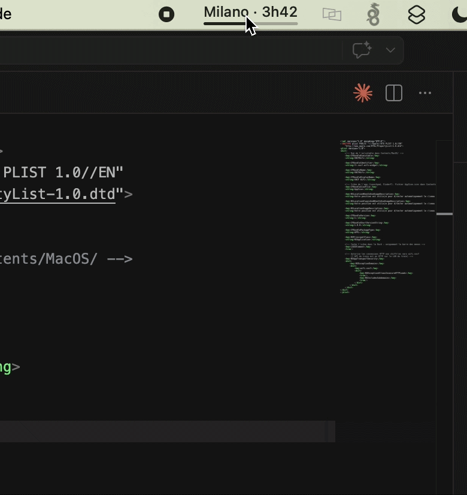
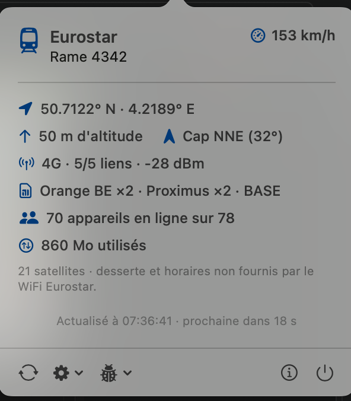
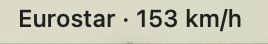
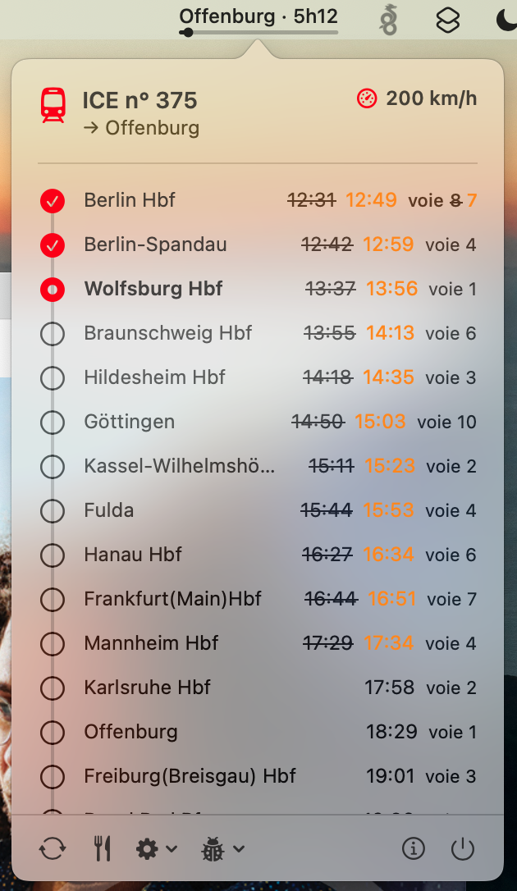
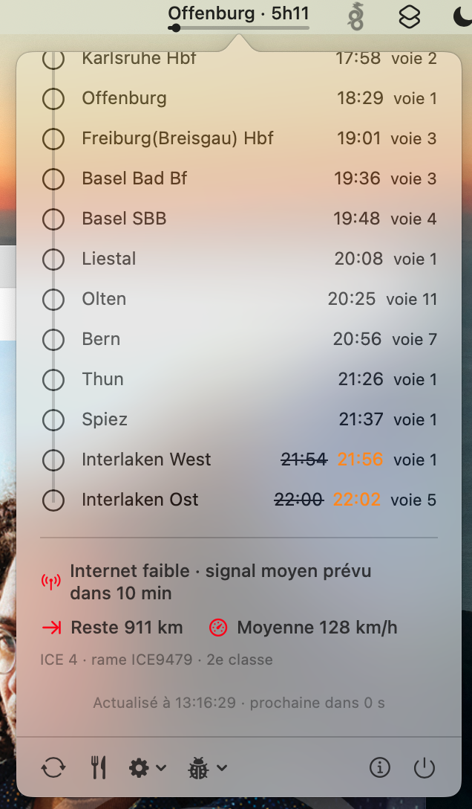
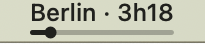
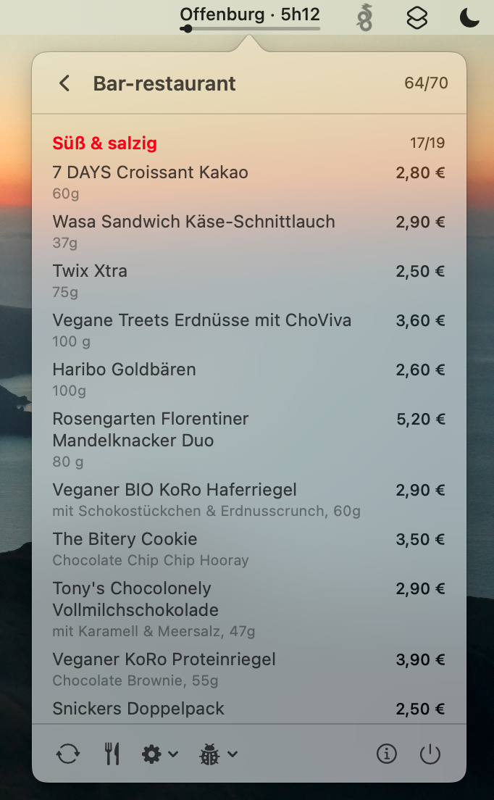
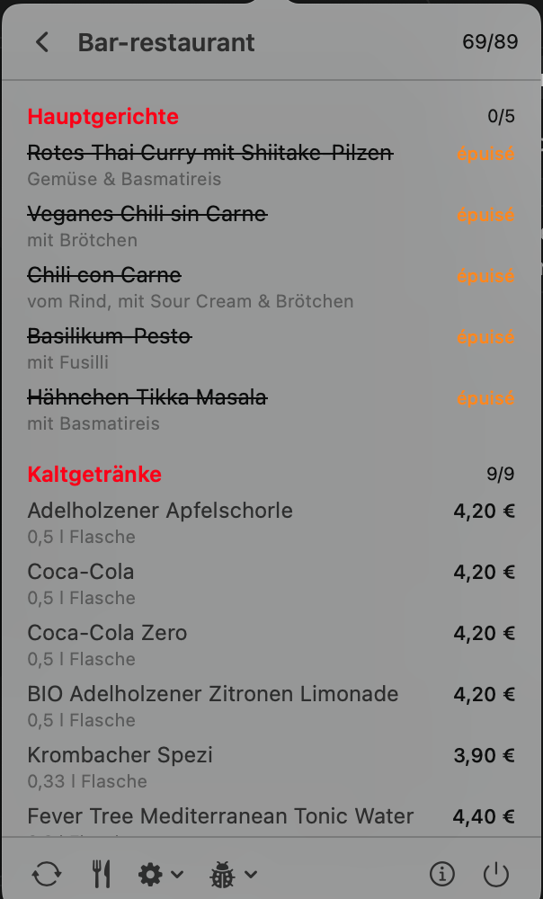

# SNCFWifi — Widget barre de menus macOS 🚄

[](https://github.com/sebeauvoir/sncfwifi-macwidget/actions/workflows/build.yml)
[](https://github.com/sebeauvoir/sncfwifi-macwidget/releases/latest)
[](https://github.com/nuclearrockstone/coding-with-ai-badge)

Un widget pour la barre de menus macOS qui exploite l'API du portail WiFi de votre train pour
afficher en temps réel les informations de votre trajet : gare suivante, vitesse, retard,
données mobiles, etc.

> Fork de [antvgr/sncfwifi-macwidget](https://github.com/antvgr/sncfwifi-macwidget) : la pastille
> affiche la vitesse du train, relue chaque seconde, avec la jauge de progression du trajet.

Quatre réseaux embarqués sont pris en charge et détectés automatiquement — **WiFi SNCF**, **WiFi
Eurostar** (transmanche et continental), **WIFIonICE** (Deutsche Bahn) et **WiFi TGV Lyria**
(Paris ↔ Suisse). Ils n'exposent pas les mêmes données : le tableau des [réseaux pris en charge](#réseaux-wifi-pris-en-charge-) détaille ce
qui est disponible dans chaque train.

---

## Le widget 🖥️

**Pastille** — la vitesse du train, en permanence et sur tous les réseaux, et à sa droite les
kilomètres restants jusqu'à la gare d'arrivée choisie ; unités en petit sous les valeurs, jauge
de progression du trajet en dessous quand le réseau expose une desserte (SNCF, ICE, Lyria). Les
kilomètres sont ceux de l'API (SNCF : somme des `progress.remainingDistance` des tronçons jusqu'à
l'arrivée, comme « Suivi du trajet » sur le portail ; ICE : `distanceFromStart`), diminués chaque
seconde de la distance parcourue d'après le GPS entre deux lectures ; à défaut, le long du tracé
publié (Lyria) ou de gare en gare. Elle est relue chaque seconde via un seul endpoint léger ; le reste des
données est rafraîchi toutes les 5 s.
Prochain arrêt, temps restant et retard restent consultables dans le panneau.

**Panneau** — numéro de train, destination, vitesse et kilomètres restants en en-tête ; desserte complète avec les
horaires théoriques barrés en cas de retard ; une carte du trajet, à la manière de
`wifi.sncf/fr/journey` : portion parcourue et reste du trajet, gares et train en pastilles, position
relue chaque seconde. Un bouton sur la carte alterne deux modes, mémorisés : **trajet**, cadrage
du train jusqu'à la gare d'arrivée choisie avec zoom automatique (un zoom ou un déplacement à la
main suspend le suivi une minute) ; **suivi**, train toujours au centre, la carte défile sous lui
et seul le zoom reste permis. Échelle et mentions légales en pied de carte, comme sur le portail. En bas du panneau, une section
**En vrac** (WiFi SNCF) rassemble le reste de ce que l'API expose : altitude, cap, distance
parcourue, vitesse moyenne, temps restant, débit accordé, attente au bar, CO₂ évité par rapport à
la voiture, durées d'arrêt, numéro de rame. Le tracé suit les voies quand le réseau le
publie (SNCF, Lyria) ; ailleurs, la portion parcourue suit les positions relevées depuis le lancement
de l'app et le reste relie les gares en ligne droite. Sur le WiFi SNCF, le fond de carte est celui
du portail, servi par le train (MapLibre, tuiles PMTiles) : **aucune requête vers Internet**. Les
autres réseaux n'embarquant pas de tuiles, leur carte utilise le fond Apple, chargé depuis
Internet ; puis les métriques propres au réseau. Un second
écran affiche la carte du bar quand le réseau la publie.

**Réglages** — gare d'arrivée de référence (elle pilote l'ETA et la progression), notification
système 5 / 10 / 15 min avant l'arrivée, notification de changement de voie.

---

## Réseaux WiFi pris en charge 🚆

| Réseau | Trains | API | Desserte · retard · ETA | Voie | Vitesse | Position | Opérateurs | Données | Connectivité | Carte du bar |
|---|---|---|---|---|---|---|---|---|---|---|
| **WiFi SNCF** | TGV INOUI, Intercités | `wifi.sncf` | ✅ | ❌ | ✅ | interne¹ | ❌ | ✅ | ✅ (0…5) | ❌⁴ |
| **WiFi Eurostar** | Eurostar transmanche (Londres ↔ Paris / Bruxelles / Amsterdam) et Eurostar continental (ex-Thalys) | `ombord.info` (Icomera) | ❌² | ❌ | ✅ | ✅ | ✅ | ✅ | ✅ (lien montant³) | ❌ |
| **WIFIonICE** | ICE (Deutsche Bahn) | `iceportal.de` | ✅ | ✅ | ✅ | ✅ | ❌ | ❌⁵ | ✅ **+ prévision** | ✅ |
| **WiFi TGV Lyria** | TGV Lyria (Paris ↔ Suisse) | `wifi.tgv-lyria.com` (Moment/21Net) | ✅ desserte, ⚠️ retard⁷ | ❌ | ✅ | ✅ | ❌ | ❌⁶ | ✅ (0…5) | ❌ |

<sub>¹ La position GPS sert à détecter l'arrêt en gare, elle n'est pas affichée. ·
² L'API du portail n'expose aucune donnée de trajet, voir ci-dessous. ·
³ Le RSSI disponible est celui des modems 4G du toit, pas du WiFi de la voiture : il est affiché
comme « lien montant » plutôt que déguisé en qualité WiFi. ·
⁴ L'endpoint `bar/attendance` est lu et présent dans le JSON de debug, mais sa sémantique reste à
confirmer. ·
⁵ Le WiFi des ICE est sans quota : l'API n'expose aucun compteur. ·
⁶ Le portail Lyria n'expose aucun compteur de données. ·
⁷ Les horaires servis sont ceux du sillon théorique : sur la rame observée ils n'ont jamais
été réactualisés, voir ci-dessous.</sub>

### 🇫🇷 WiFi SNCF — TGV INOUI, Intercités

SSID reconnus : `_SNCF_WIFI_INOUI`, `OUIFI`, `SNCF_WIFI_INTERCITES`, `WIFI_SNCF`

> Les TGV **Lyria** figuraient ici avec le SSID `_WIFI_LYRIA`. Mesure faite à bord : ce SSID est
> celui d'un portail distinct (voir plus bas), et il envoyait donc ces rames vers une API absente
> du train.

<p align="center">
  
</p>

| Endpoint | Contenu utilisé |
|---|---|
| `GET /router/api/train/gps` | vitesse (**en m/s**), latitude, longitude |
| `GET /router/api/train/progress` (ou `/details`) | numéro de train, arrêts, horaires, retard et cause |
| `GET /router/api/connection/statistics` | qualité WiFi (0…5), appareils connectés |
| `GET /router/api/connection/status` | données consommées / restantes, prochaine remise à zéro |
| `GET /router/api/bar/attendance` | affluence au bar — lue et présente dans le JSON de debug, pas encore affichée |
| `GET /co2/meta.json` | part de CO₂ évitée par rapport à la voiture, par couple de gares (codes UIC de `details.stationUicCodes`), chargée une fois |
| `GET /router/api/train/graph` | tracé des voies du trajet, GeoJSON `LineString` d'origine en terminus (~40 Ko), chargé **une fois par trajet** pour la carte |
| `GET /karto/style-light.json`, `/maps/*.pmtiles`, `/maps/fonts/…`, `/maps/sprites/…` | fond de carte hors ligne du portail (style MapLibre, tuiles vectorielles PMTiles de l'Europe et des voies ferrées) — voir `Resources/Map/README.md` |

### 🇪🇺 WiFi Eurostar — transmanche et continental (ex-Thalys)

Toute la flotte Eurostar utilise le portail Icomera « Internet Ombord », que ce soit sur les
liaisons transmanche ou sur les rames continentales héritées de Thalys.

SSID reconnus : `EurostarWiFi`, `Eurostar WiFi`, `Eurostar`, `_EUROSTAR_WIFI`, `THALYSNET`, `_THALYSNET`

<p align="center">
  
  &nbsp;&nbsp;
  
</p>

Ce portail n'expose **ni desserte, ni horaires, ni retard**. Une API PIS existe
(`onboard.eurostar.com/services/pis/v1/journey`, `/route`, `/stations`, `/vehicle`) mais répond
`{"error":"journey not found"}` là où elle a été testée : c'est une limite de l'API embarquée, pas
du widget. Le panneau se limite donc à la position, la vitesse, l'altitude, le cap, l'état des
liens montants et les opérateurs mobiles agrégés (`Orange BE ×2 · Proximus ×2 · BASE`).

> Les relevés d'endpoints ci-dessous ont été faits sur une rame **continentale** (`eurostar-4342-2i`).
> La flotte transmanche partageant le même portail Icomera, les mêmes endpoints s'appliquent ;
> si vous constatez un écart à bord, **Debug → Copier le JSON** donne le détail des réponses.

| Endpoint | Contenu utilisé |
|---|---|
| `GET https://www.ombord.info/api/jsonp/position/` | latitude, longitude, altitude, vitesse (**en m/s**), `cmg` (cap), satellites |
| `GET https://www.ombord.info/api/jsonp/user/` | quota de l'appareil (`data_total_used` / `data_total_limit`, en octets) |
| `GET https://www.ombord.info/api/jsonp/users/` | appareils connectés (`online` / `total`) |
| `GET https://www.ombord.info/api/jsonp/connectivity/` | liens montants : technologie, RSSI, `operator_id` (PLMN → opérateur) |
| `GET https://www.ombord.info/api/jsonp/system/` | `system_name` (ex. `eurostar-4342-2i`) → numéro de rame |

> Ces réponses sont du **JSONP même sans paramètre `callback`** (`({ … });`) : le corps est
> décapsulé avant d'être décodé.

### 🇩🇪 WIFIonICE — ICE (Deutsche Bahn)

SSID reconnu : `WIFIonICE`

<p align="center">
  
  &nbsp;&nbsp;
  
</p>
<p align="center">
  <sub>La desserte donne la <b>voie de chaque arrêt</b> et signale les changements (Berlin Hbf,
  voie <s>8</s> 7) ; en bas du panneau, la connectivité et sa prévision, la distance restante, la
  vitesse moyenne et l'identité de la rame.</sub>
</p>
<p align="center">
  
</p>

Deux particularités de ce portail : la progression est calculée sur les **distances réelles**
relevées par le train, et non estimée à partir des horaires ; et la connectivité est annoncée avec
une **prévision** (« Internet instable · signal faible prévu dans 20 min »). Un changement de voie
sur la gare d'arrivée déclenche une notification système.

En revanche l'API ne donne pas la **cause** du retard, seulement sa durée, et n'expose aucun
compteur de données — le WiFi des ICE est sans quota.

#### 🍽️ La carte du bar-restaurant

Seul des trois portails à publier son offre à bord. L'icône couverts du pied de page n'apparaît que
si la rame déclare son service de commande actif, et ouvre un second écran du popover.

<p align="center">
  
  &nbsp;&nbsp;
  
</p>
<p align="center">
  <sub>Prix, grammages et descriptions ; les articles <b>épuisés</b> sont barrés, et chaque
  catégorie affiche son compteur de disponibilité (l'en-tête donne le total, ici 64 références sur
  70 encore servies).</sub>
</p>

La carte pèse près de 90 Ko : elle n'est chargée qu'à l'ouverture de ce panneau, jamais à chaque
cycle de rafraîchissement. Elle n'existe qu'**en allemand** — `Accept-Language`, les paramètres
d'URL et le bundle du portail donnent tous la même réponse : le sélecteur de langue du site traduit
les libellés, pas le catalogue.

| Endpoint | Contenu utilisé |
|---|---|
| `GET https://iceportal.de/api1/rs/status` | vitesse (**en km/h**, contrairement aux deux autres réseaux), position, `vzn` (n° de train), `tzn` (rame), `series` (modèle), classe, `connectivity` (état courant **et** prévision) |
| `GET https://iceportal.de/api1/rs/tripInfo/trip` | arrêts, horaires prévus et réels, retards, **voie prévue et réelle**, distances (`actualPosition`, `distanceFromLastStop`, `totalDistance`) |
| `GET https://iceportal.de/bap/api/bap-service-status` | service de commande actif ou non — conditionne l'icône couverts |
| `GET https://iceportal.de/bap/api/products` | carte du bar-restaurant : catégories, prix (EUR/CHF), disponibilité |

> ⚠️ `actualPosition` n'est **pas** la position du train mais la distance du dernier arrêt passé.
> La position réelle vaut `actualPosition + distanceFromLastStop`.

### 🇨🇭 WiFi TGV Lyria — Paris ↔ Suisse

Les rames franco-suisses n'utilisent **pas** l'API `wifi.sncf` des TGV INOUI mais un portail
Moment/21Net qui leur est propre. Il donne la desserte complète, avec les coordonnées de chaque
gare, mais aucun compteur de données.

SSID reconnu : `_WIFI_LYRIA`

| Endpoint | Contenu utilisé |
|---|---|
| `GET https://wifi.tgv-lyria.com/api/travel/` | numéro de train, arrêts (code UIC, libellé localisé, coordonnées), horaires théoriques et réels par arrêt |
| `GET https://wifi.tgv-lyria.com/api/train/gps/position/` | vitesse (**en m/s**), latitude, longitude, altitude |
| `GET https://wifi.tgv-lyria.com/api/wifi/status/` | qualité WiFi (0…5), appareils connectés |
| `GET https://wifi.tgv-lyria.com/api/transport/current/` | numéro de rame — une chaîne JSON nue (`"4729"`), pas un objet |
| `GET https://wifi.tgv-lyria.com/api/travel/path/` | tracé GeoJSON du parcours (~55 Ko), chargé **une fois par trajet** pour la carte |

`/api/travel/position/` existe aussi et n'est pas consommé : mêmes coordonnées, parfois rejouées
sous l'id `gps-fallback`.

Comme les horaires ne sont pas réactualisés (voir ci-dessous), **le prochain arrêt et la jauge de
progression sont déduits de la position GPS** et non des heures annoncées : la position est
projetée sur la ligne brisée reliant les gares, dont les segments sont pondérés par leur durée
théorique.

> ⚠️ **Les horaires sont suffixés `Z` mais portent l'heure locale**, celle du fuseau annoncé à
> côté par `departureTimezone` / `arrivalTimezone`. Lus comme de l'UTC, ils décalent toute la
> timeline de deux heures. C'est la raison d'être de ces deux champs, superflus si les dates
> étaient réellement en UTC.

> ⚠️ **Horaires figés au sillon théorique.** Sur la rame observée, `realArrivalDate` est resté
> rigoureusement égal à `initialArrivalDate` et `delay` à 0 pendant tout le trajet — y compris à
> l'arrêt en gare, alors que le train y est entré 39 min avant l'heure annoncée (arrêt mesuré à
> 10:18:55, heure publiée 10:58). Ce portail n'a donc montré **aucun suivi temps réel** : le retard
> affiché restera 0 et l'ETA peut être décalé de plusieurs dizaines de minutes. Le code lit bien
> l'écart entre horaire réel et théorique ; c'est l'API qui ne le renseigne pas.

> ⚠️ Le portail est un Next.js qui **répond 200 avec sa page d'accueil pour tout chemin inconnu** :
> un code HTTP ne prouve rien, chaque réponse doit être validée sur son contenu. Les chemins
> exigent aussi leur **slash final**, faute de quoi le serveur répond 308.

### Comment le réseau est détecté

1. Le **SSID** est comparé aux listes ci-dessus : s'il correspond, l'API du réseau est appelée
   directement.
2. Si le SSID est **inconnu** ou **illisible** (macOS 14.4+ exige l'autorisation Localisation pour
   le lire), les APIs de tous les réseaux sont sondées en parallèle, un appel chacune. Le verdict
   est mémorisé par SSID pour ne pas re-sonder à chaque cycle ; un réseau sans train est écarté
   pendant 5 min, et le bouton **Actualiser** court-circuite ce délai.
3. Un réseau peut exiger que l'hôte de son API résolve vers une **adresse privée** : à bord,
   `ombord.info` pointe sur le routeur du train. Sans ce contrôle, une API joignable depuis
   l'internet public pourrait afficher un train fantôme.

Hors d'un réseau connu, le widget ne fait aucun appel : c'est autant de batterie économisée.

---

## Téléchargement ⬇️

> Pas besoin de compiler — téléchargez directement le `.zip` depuis la page **Releases**.

**[→ Télécharger la dernière version](https://github.com/sebeauvoir/sncfwifi-macwidget/releases/latest)**

1. Décompressez le `.zip`
2. Glissez `SNCFWifi.app` dans votre dossier `Applications`
3. Double-cliquez pour lancer — l'icône apparaît dans la barre des menus

> **macOS bloque l'app** (non signée avec un certificat Apple Developer) lors du premier lancement. Deux options :
> - **Méthode simple** : faites un **clic droit → Ouvrir** sur `SNCFWifi.app`, puis cliquez **Ouvrir** dans la fenêtre d'avertissement
> - **Via le Terminal** : après avoir déplacé l'app dans `/Applications`, exécutez `xattr -cr /Applications/SNCFWifi.app` puis double-cliquez normalement

💡 **Lancement automatique au démarrage** : `Réglages Système > Général > Éléments de connexion` → cliquez `+` et ajoutez `SNCFWifi.app`.

---

## Installation via Homebrew 🍺

```bash
brew tap sebeauvoir/sncfwifi https://github.com/sebeauvoir/sncfwifi-macwidget
brew install --cask sncfwifi
```

Mise à jour vers la dernière version :

```bash
brew reinstall --cask sncfwifi
```

> L'app étant signée en ad-hoc, si macOS la bloque au premier lancement :
> `xattr -dr com.apple.quarantine /Applications/SNCFWifi.app` (ou clic droit → **Ouvrir**).

---

## Prérequis ⚙️

- macOS 11 (Big Sur) ou plus récent — Apple Silicon et Intel (binaire universel)
- Connexion au WiFi d'un train pris en charge (SNCF, Eurostar ou ICE) pour que l'API réponde
- *(pour compiler)* Xcode Command Line Tools (`xcode-select --install`)

---

## Compilation manuelle 🔨

Un script bash compile et empaquète le projet en `.app` :

```bash
chmod +x build.sh
./build.sh
open SNCFWifi.app
```

---

## Ajouter un réseau 🧩

Un réseau = **un fichier**. Rien à modifier dans les vues, le contrôleur ou la pastille.

**1.** Créez `Sources/MonReseauDataSource.swift` conforme à `TrainDataSource` :

```swift
final class MonReseauDataSource: TrainDataSource {

    let descriptor = TrainProviderDescriptor(
        id: "monreseau",
        displayName: "Mon Réseau",
        ssids: ["mon_wifi_train"],        // en minuscules
        accentHex: 0x1B7F4B,              // couleur d'accent du panneau
        features: [.speed, .position],    // pilote la forme du panneau
        apiHost: "portail.exemple",
        requiresPrivateAPIHost: true      // l'API n'est joignable qu'à bord
    )

    func probe(completion: @escaping (Bool) -> Void) {
        // Un seul appel : « suis-je à bord ? »
    }

    func fetchLive(completion: @escaping (LiveFix?) -> Void) {
        // Vitesse en km/h et position, via un unique endpoint léger : la pastille
        // et la carte les relisent chaque seconde. nil si pas de réponse.
    }

    func fetch(completion: @escaping (TrainSnapshot?) -> Void) {
        // Appelez votre API, puis rendez un TrainSnapshot (nil si injoignable).
        // Les spécificités du réseau passent par TrainViewState.metrics :
        //   MetricRow(id: "position", symbol: "location.fill", text: "…")
        // Renseignez StopRow.coordinate et TrainViewState.trainCoordinate pour
        // placer gares et train sur la carte du panneau.
        // Déclarez .journey et remplissez stops + JourneyContext pour obtenir
        // la timeline, l'ETA et les notifications d'arrivée sans code en plus.
        // Renseignez StopRow.platform / .scheduledPlatform et la voie s'affiche
        // dans la timeline, avec notification si elle change.
    }

    // Facultatif : déclarez .onboardMenu et implémentez fetchMenu pour obtenir
    // le panneau restaurant et son icône dans le pied de page. Sans cela, la
    // valeur par défaut du protocole répond « pas de carte ».
    func fetchMenu(completion: @escaping (OnboardMenu?) -> Void) { … }
}
```

**2.** Enregistrez-le dans `TrainProviders.all` (`Sources/TrainProvider.swift`). L'ordre ne sert
qu'à départager si deux réseaux répondent : aucun n'est privilégié.

**3.** Ajoutez le fichier à `SWIFT_SOURCES` dans `build.sh` (la liste est explicite, pas un glob).

**4.** Testez : `./build.sh && open SNCFWifi.app`, et **Debug → Copier le JSON** pour vérifier les
payloads bruts reçus. Sans être à bord, un petit binaire de sonde suffit :
`swiftc Sources/*.swift votre_main.swift -o sonde`.

---

## Mode Démo via serveur local 🧪

Permet de simuler un trajet sans être dans le train, **sur les deux réseaux** : le serveur sert
les endpoints SNCF et les endpoints Icomera en parallèle, et **Debug → Réseau simulé** choisit
lequel l'app interroge.

1. Lancer le serveur :
   ```bash
   chmod +x start_demo_server.sh
   ./start_demo_server.sh
   ```
2. Ouvrir le panneau de configuration :
   - dans l'app : **Debug → Ouvrir le panneau démo**
   - ou directement : `http://127.0.0.1:8787`
3. Activer **Debug → Mode Démo** dans l'app.

Le panneau HTML fait varier vitesse, retard et cause, index d'arrêt, arrêt en gare, qualité WiFi
et données côté SNCF, ainsi que le système, les modems, les opérateurs et le quota côté Eurostar.

---

## À intégrer plus tard 📋

- **Serveur démo piloté par scénarios** : un dossier JSON par réseau, pour ne plus toucher au
  Python à chaque ajout de réseau. Le serveur rejoue aujourd'hui SNCF et Icomera, **pas encore
  ICE** — le chemin ICE se teste donc à bord.
- **Affluence au bar** : l'endpoint SNCF est lu mais la sémantique de `attendance` reste à
  confirmer avant de l'afficher.
- **Position en mode SNCF** : les coordonnées sont déjà là, elles pourraient alimenter les mêmes
  métriques que le mode Eurostar.
- **Eurostar** : re-tester l'API PIS sur d'autres rames, notamment **transmanche** — elle existe,
  elle n'est simplement pas provisionnée sur celles observées. Si elle répond, la desserte, l'ETA
  et les notifications s'activent en déclarant `.journey` sur le descripteur.
- **Contrôle d'hôte privé pour SNCF** : à bord d'un TGV, vérifier `dig +short wifi.sncf` puis
  activer `requiresPrivateAPIHost` sur le descripteur SNCF.
- **Réseaux repérés, non pris en charge** : Trenitalia (`portalefrecce.it`), NS, Renfe,
  TER / Ouigo.

---

## Logos des compagnies 🎨

L'en-tête du panneau affiche le logo de la compagnie à la place de l'icône générique quand le
fichier est présent : déposez `logo-sncf.png` ou `logo-eurostar.png` dans `Resources/Logos/`
(conventions et variantes `@2x` / mode sombre détaillées dans
[`Resources/Logos/README.md`](Resources/Logos/README.md)). Les logos étant des marques déposées,
le dépôt n'en embarque aucun : leur absence est un cas normal.

---

## Développé avec l'IA 🤖

Ce projet a été développé en grande partie avec l'aide de l'Intelligence Artificielle.


